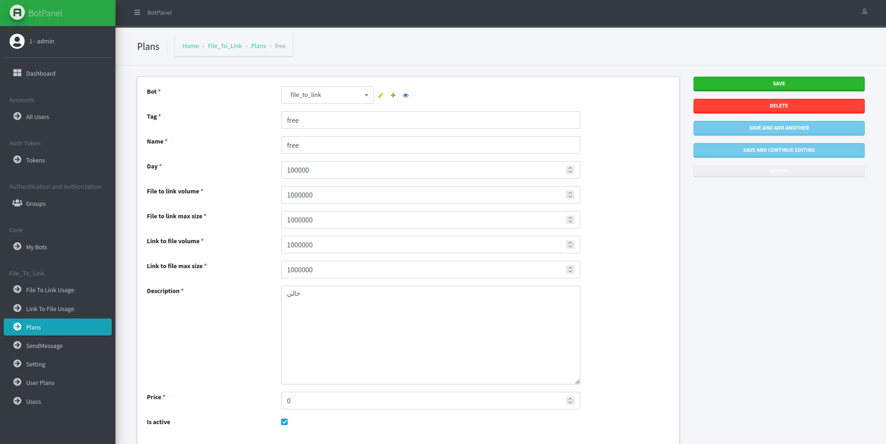

## ربات تلگرام تبدیل فایل به لینک و لینک به فایل
 
 
 
 

    

        

            <h2>قابلیت‌های ربات</h2>
            <ul>
                <li>تبدیل در لحضه فایل های تلگرام به لینک مستقیم دانلود</li>
                <li>تبدیل لینک های دانلود به فایل تلگرام</li>
                <li>ادمین پنل حرفه‌ای توسعه یافته با جنگو</li>
            </ul>
        

        

            

    

        

    

 
 
 

# ادمین پنل

- استفاده از قالب ادمین جنگو [Jazzmin](https://github.com/farridav/django-jazzmin)
- مدیریت کامل یوزر ها
- ارتقا و تنزیل کاربران
- ارسال پیام تکی و همگانی به کابران

- ایجاد پلن های متنوع حجمی و زمان دار
- تنظیم متن همه بخش های ربات 
- مدیریت تسک ها
- اضافه کردن ربات های دلخواه
- خاموش و روشن کردن تمام بخش های ربات
- ...

    

 

